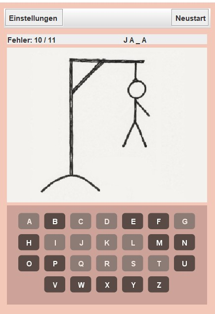
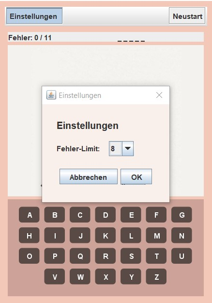
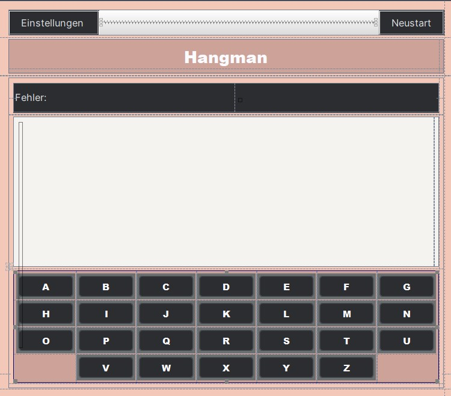

# Hangman  
Author: Sara Kutschi    
LBS Eibiswald | 2aAPC  

Ein kleines Java-Projekt mit grafischer Oberfläche: ein **Hangman-Spiel**, erstellt mit dem *IntelliJ GUI Designer (Swing)*.  

---

## Features
- **Wort-Raten-Spiel** mit zufällig gewähltem Begriff aus einer Wortliste  
- **Fehlerzählung & Limit**:
  - Start mit 0 Fehlern  
  - Maximale Fehlversuche können in den *Einstellungen* angepasst werden  
- **Grafische Darstellung**:
  - Das Hangman-Bild verändert sich nach jedem Fehlversuch  
- **Interaktive Tastatur**:
  - Klickbare Buchstaben-Buttons  
  - Hover-, Pressed- und Disabled-Farben im dunklen Mocha-Stil  
- **Toolbar**:
  - **Einstellungen**: öffnet ein neues Fenster zur Auswahl des Fehlerlimits  
  - **Neustart**: setzt Spiel, Wort und Fehlerzähler zurück  
- **Spielende**:
  - Meldung bei Sieg oder Niederlage mit dem richtigen Wort  

---

## Umsetzung
1. **GUI-Form anlegen**  
   - `File ▸ New ▸ GUI Form` → Name/Klasse: `HangmanForm`, Layout: `GridLayoutManager`  
   - IntelliJ erzeugt automatisch `.form` und `.java`-Dateien  

2. **Oberfläche gestalten**  
   - **Panels**:
     - `HeaderPanel` mit Toolbar  
     - `ImagePanel` für das aktuelle Hangman-Bild  
     - `InfoPanel` für Fehlversuche & Wortanzeige  
     - `LetterPanel` mit Buchstaben-Tasten  
   - Hintergrundfarben im **Peach-/Rose-Design**  
   - Einheitliche Schriftarten & Abstände  

3. **Bound Class & Logik (`HangmanForm`)**  
   - Komponenten an die Bound Class binden  
   - Hauptmethoden:
     - `handleGuess()` → prüft geratenen Buchstaben  
     - `restartGame()` → setzt Spiel + Wort neu  
     - `openSettings()` → öffnet modales Einstellungsfenster  
     - `fitImageToCard()` → skaliert das Hangman-Bild  

4. **Game-Klasse**  
   - Verwaltet den Spielzustand:
     - `word`, `guessed`, `fails`, `maxFails`  
   - Methoden:
     - `guessLetter()` – überprüft Buchstaben  
     - `reset()` – wählt neues Wort & setzt Zähler zurück  
     - `setMaxFails()` – übernimmt geändertes Fehlerlimit aus den Einstellungen  

5. **Settings-Fenster**  
   - Als eigenes `JDialog`-Form implementiert  
   - Ermöglicht Auswahl des **Fehlerlimits (6–15)**  
   - Änderung wird sofort auf das aktuelle Spiel angewendet  

---

## Ergebnis

### 🎮 Spielansicht

### ⚙️ Einstellungen-Fenster

### 🧩 IntelliJ GUI Designer

